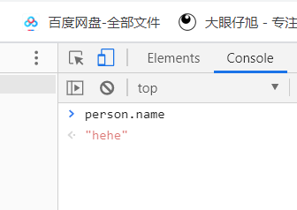
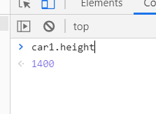

# 原型

：是function的一个属性，它定义了构造函数构造出对象的公共祖先。原型也是对象。通过构造函数产生的对象

可以继承该原型的属性和方法。

什么意思呢？

例如

```js
Person.prototype.name='hehe'
function Person(){
    
}
var person = new Person();
```

运行：




```js
  <script>
    	
 	
		function Car(color,owner){
			this.owner = owner;
			this.color =color
    
			}
		Car.prototype.height = 1400;
		Car.prototype.lang = 4900;
		Car.prototype.carName = 'BMW';
//也可以这样写
//		Person.prototype = {
//            height : 1400,
//            lang : 4900,
//            carName : 'BMW'
//        }
		var car = new Car('red','zhang')
		var car1 = new Car('red','hao')
    </script>
```

运行：



#### 原型的增删改查

只有通过Person.prototype.name才能修改原型的属性，如果只是Person.name只是增加Person的属性。

可以通过constructor查看对象的构造函数，也可以手动更改。

```js
function Person () {
    
}
Car.prototype = {
    constructor :car
}
function Car(){
    
}
var car = new Car();
```

